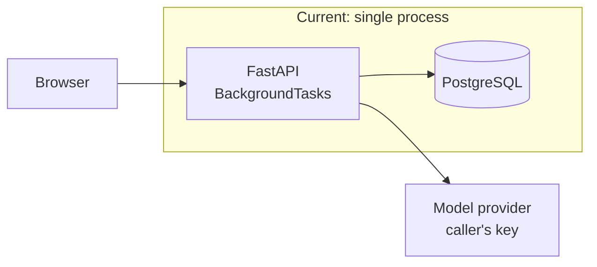
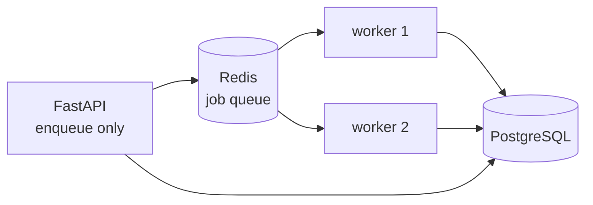

# Roadmap

How repo-radar is built, what it deliberately is not, and what would have to
change for it to carry more load.

This is a design document rather than a task list. Each stage states the
**constraint that forces the change**, so a reader can tell whether the change is
warranted yet.

---

## Design principles

These decide arguments. Where a later section conflicts with one of these, the
principle wins.

**1. Infrastructure arrives with the measurement that justified it.**
No queue, cache or broker is added because a diagram looks better with one. The
question is always "what did we measure that this fixes".

**2. An agent's output is untrusted until it is scored.**
Every auditor is measured against fixtures with known defects. A prompt is code;
code without tests is a guess.

**3. Silence is the dangerous failure.**
An audit that reports nothing must be distinguishable from an audit that could
not run. This is guarded at every layer, because it has failed at two of them.

**4. Money is a first-class type.**
Costs are `Decimal`, priced before a call rather than counted after, and bounded
per run. A tool spending someone else's credit owes them a number.

**5. The provider is an implementation detail.**
Everything above `LLMClient` is vendor-neutral. Adding a provider is a new file,
never an edit to existing logic.

---

## Where it is now

| Property | Today |
| --- | --- |
| Concurrency | One process, `asyncio` fan-out across auditors |
| Queue | None. `BackgroundTasks` |
| State | Postgres only |
| Auditors | 3 |
| Providers | Anthropic, Gemini, OpenAI |
| Auth | None. Bring your own key per request |
| Deployment | Containerised, not hosted |

**What this supports:** a handful of concurrent runs on one machine. A run takes
roughly 30–90 seconds and costs about a cent.

**Where it breaks first:** a process restart loses in-flight runs. That is the
constraint that motivates Stage 1, and nothing before it.

---

## Stage 1 — Durable work

**Trigger:** in-flight runs are lost on deploy or crash, or one process can no
longer keep up with submissions.

`BackgroundTasks` dies with its process. Today that costs a user one run and they
retry. It stops being acceptable once runs are long, paid for, or numerous.

- `arq` over Redis: async-native, and the smallest thing that survives a restart
- Workers scale horizontally; the API becomes stateless
- Retries with backoff for provider errors, which are already retried in-process
- **Migration note:** the websocket already polls Postgres rather than subscribing
  in memory, precisely so this change does not touch it

**Explicitly not yet:** Celery. It brings a broker abstraction, a result backend
and a scheduler this project has no use for.

---

## Stage 2 — Accountability

**Trigger:** the service is reachable by anyone, or more than one person uses it.

Today a run is identified by an unguessable UUID and nothing else. That is fine
for a local tool and wrong for a shared one.

- API keys or OAuth for **callers**, kept distinct from the model keys they bring
- Runs owned by an account; the run list scoped to the owner
- Per-account quotas, separate from the per-run cost ceiling
- Audit log of who ran what against which repository

The model key stays per-request and unstored. Owning a run must never imply
storing the credential that produced it.

---

## Stage 3 — Auditor depth

**Trigger:** the auditors are trusted enough that their blind spots matter more
than their false positives.

The current three read a whole repository in one call. That is honest for small
repositories and quietly wrong for large ones: a repository beyond the context
window is silently truncated.

- **Chunked reading** with a map-reduce pass, so repository size stops bounding
  what is seen
- **Cross-file reasoning** — the current `dead_code` auditor cannot follow a call
  graph, only references it can see in the text it was given
- **More auditors:** dependency hygiene, CI configuration, documentation drift
- **Deduplication across auditors**, which today report the same problem twice
- **Language-aware fixtures**, since the evaluation is currently Python-only while
  real runs are not

Each new auditor is gated the same way: a fixture, a golden file, a threshold.
An auditor without an evaluation does not ship.

---

## Stage 4 — Evaluation at scale

**Trigger:** two fixtures stop being enough to catch a regression.

The current harness proves the prompts work on unambiguous cases. It says nothing
about a large repository where dead code is genuinely debatable.

- **A wider fixture corpus**, including real repositories with human-labelled
  findings
- **Inter-rater agreement**: if two experienced reviewers disagree about a
  finding, the model disagreeing with one of them is not a defect
- **Per-category thresholds**, since `hardcoded_credential` should be held to a
  far higher bar than `commented_out_code`
- **Cost regression tracking**, so a prompt that doubles token usage fails the
  same way a prompt that halves recall does
- **Model comparison**: the same fixtures across providers, to answer "is the
  expensive model worth it" with a number

This is the stage that matters most for the product's credibility, and the one
most likely to be skipped.

---

## Stage 5 — Operations

**Trigger:** someone other than the author depends on it being up.

- Structured logging with a run id on every line
- Tracing across the fan-out, so a slow auditor is visible
- Metrics: runs per hour, cost per run, per-auditor failure rate, cassette staleness
- Readiness probe distinct from liveness — the current `/health` deliberately does
  not touch the database, so that a database blip does not restart a healthy process
- Alerting on the two things that matter: runs failing, and cost per run drifting

---

## Non-goals

Stating these prevents re-litigating them.

| Not doing | Why |
| --- | --- |
| Hosting a public demo | Bring your own key means a visitor would paste their own credential into someone else's site. A recorded walkthrough is more honest and more useful. |
| Fixing the code it finds | Suggesting a patch is a different product with different failure modes. Reporting wrongly wastes a reader's minute; patching wrongly costs them an afternoon. |
| A vendor SDK per provider | Three thin adapters over HTTP are ~120 lines each, keep cassettes readable, and avoid three dependency trees that update independently. |
| Running the audited code | Never. Cloned repositories are read as text. No install, no build, no test execution. |
| Replacing linters | `ruff` and `mypy` are faster, cheaper and more certain at what they cover. These auditors target what static analysis cannot judge. |
| A plugin system for auditors | One implementation of an interface is not an abstraction. Auditors are files in a directory until someone outside the project needs to add one. |

---

## Decision log

Decisions expensive to revisit, and the reasoning at the time.

| Decision | Reasoning | Revisit when |
| --- | --- | --- |
| Postgres only, no Redis | Nothing needed a queue or shared cache. Unused infrastructure is a maintenance cost disguised as architecture. | Stage 1 |
| Cassettes over live calls in tests | Agent tests that hit a model are slow, paid and non-deterministic. A flaky test gets ignored, and an ignored test is worse than none. | Never. This one compounds. |
| Cost reserved before a call | Checking money already spent admits every concurrent caller before any reports a cost. A live run went 2.4x over its ceiling and reported itself clean. | If auditors start making many calls each, reserve per in-flight call. |
| Finding identity excludes line and wording | An import added above a defect shifts every line. A model rephrases everything each run. A diff that cries wolf is one nobody reads. | If a category fires several times per file. |
| Raw HTTP per provider | See non-goals. | If a provider ships a feature only reachable through its SDK. |
| Tool schemas over prose parsing | A reply that does not fit the schema is a failed call, not something to guess at. | Never. |
| No frontend framework beyond Next.js | A table, badges, an input and a button. shadcn earns its place on dialogs and focus management, none of which exist. | When a dialog or combobox appears. |

---

## How to read progress

The phases that built this are recorded in the commit history, one branch each,
with the verification that closed them. The condition for "done" was never "the
code exists" but "the check that proves it passes".

That standard applies forward too. A stage here is finished when its trigger is
measurably resolved, not when its files are written.
