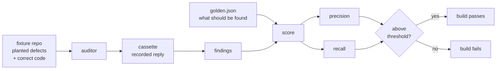
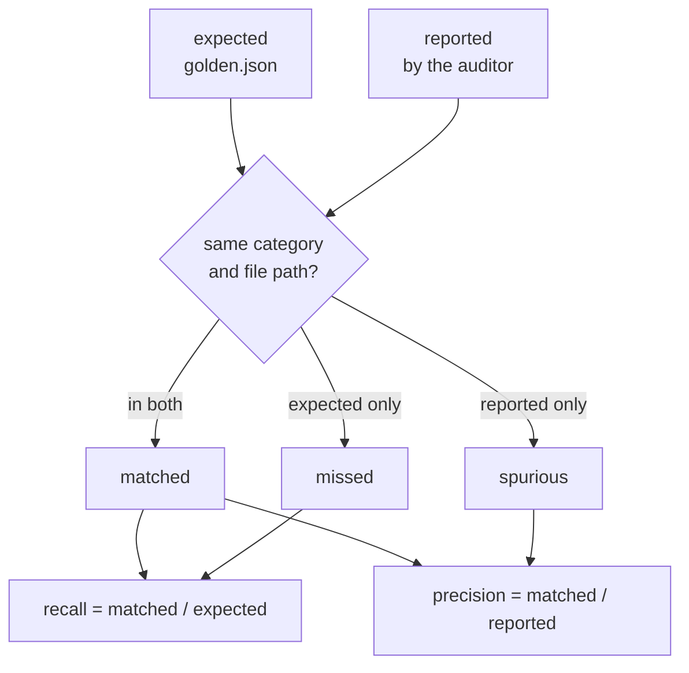
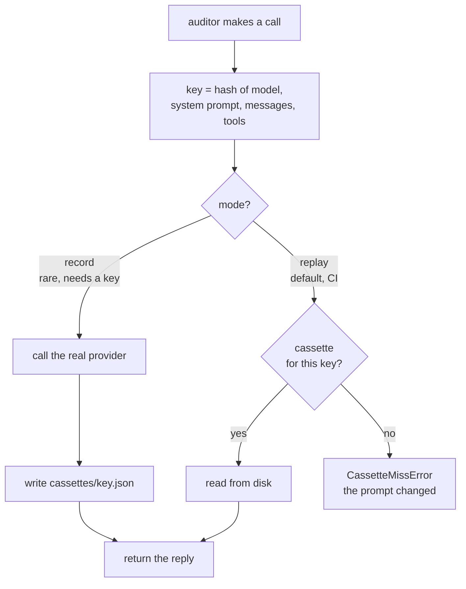

# The evaluation harness

Anyone can wire a model into a loop and call the output an audit. The hard part is
knowing whether it still works after you edit the prompt.

This document explains how repo-radar answers that, and why each choice is the way
it is.

## The problem

An auditor is a prompt. Prompts get edited: a clarification here, an extra rule
there. Each edit silently changes what the model detects, and there is no compiler
to tell you that detection got worse.

Worse, the usual way of checking — run it and read the output — is misleading.
The model rephrases everything on every run, so two runs of an unchanged prompt
already look different.

## The approach

Three pieces:

1. **Fixture repositories** with defects planted on purpose
2. **Golden files** naming what each auditor should find in them
3. **A committed threshold** for precision and recall, asserted in CI

A prompt edit that detects less fails the build.



## Fixtures

Each fixture is a small, believable project. `backend/tests/fixtures/`:

| Fixture | What it is | Planted for |
| --- | --- | --- |
| `repo_a` | a notes CLI | `dead_code` |
| `repo_b` | an accounts module with tests | `security`, `test_quality` |

### Every fixture contains correct code too

This is the part people skip. `repo_b` plants a credential written into source —
and right next to it, the same job done properly:

```python
# planted defect: a credential written into source
BILLING_API_SECRET = "correct-horse-battery-staple"

# not a defect: read from the environment
SMTP_PASSWORD = os.environ.get("SMTP_PASSWORD", "")
```

Without that second line, precision is meaningless: an auditor that flagged every
single line would score perfectly. The correct code is what catches an auditor
that cries wolf.

`repo_a` does the same with a real live path (`main.py`, `storage.py`) that must
never be reported as dead.

### The planted credential is deliberately boring

`correct-horse-battery-staple`, not a realistic-looking key. Secret scanners flag
high-entropy values and provider-shaped strings, so a realistic fake would be
blocked by GitHub push protection before it ever reached our auditor. A model
still reads it as a credential in source, which is the only property the fixture
needs.

## Golden files

Expectations are keyed by auditor, because one fixture usually carries defects for
several:

```json
{
  "expected_findings": {
    "security": [
      {
        "category": "injection_risk",
        "file_path": "accounts.py",
        "why_planted": "find_account concatenates the email argument straight into SQL."
      }
    ]
  }
}
```

`why_planted` exists so a future reader can tell a real regression from a fixture
that was always wrong.

## Scoring

**A finding matches an expectation when its category and file path match. Never
its wording.**

The model words the same defect differently every time the cassettes are
re-recorded. An evaluation that compared sentences would measure prose, not
detection, and would fail on every re-record.

- **Recall** — did it find the planted defects?
- **Precision** — was what it reported real?



Each expectation consumes at most one finding, so an auditor cannot inflate recall
by reporting the same defect repeatedly.

An auditor that reports nothing scores **perfect precision**. That is the honest
reading — it made no false claims — and it is exactly why recall exists.

## The determinism problem, and cassettes

An evaluation that calls a live model is slow, costs money, and gives a different
answer every run. A test that fails randomly gets ignored, and an ignored test is
worse than no test.

So model replies are recorded once and replayed forever:

```
backend/tests/cassettes/<hash>.json
```

The hash covers the **model, system prompt, messages and tool schemas**. Change
any of them and the key changes, so an edited prompt misses the cassette instead
of replaying an answer to a question nobody asked.

**A miss raises.** A cassette layer that quietly fell back to the network would
turn one edited prompt into a slow, paid, flaky suite without anyone noticing.



Consequences:

- the suite runs **offline**, with no API key
- it costs **nothing**
- it **cannot flake** on model non-determinism
- re-recording is a deliberate act, not a side effect

```bash
cd backend
GEMINI_API_KEY=... .venv/bin/python scripts/record_cassettes.py
```

## What is asserted

```python
CASES = [
    (DeadCodeAuditor(),    "repo_a", 1.0, 0.5),   # min recall, min precision
    (SecurityAuditor(),    "repo_b", 1.0, 0.5),
    (TestQualityAuditor(), "repo_b", 1.0, 0.5),
]
```

Recall is held at 1.0 because every planted defect is unambiguous. Precision
allows some noise, since a model reasonably notices real problems that were not
the ones planted.

Each auditor and fixture pair is a separate test, so an auditor that improved
cannot hide one that got worse.

**A second test names the files that must never be reported.** Precision alone
would let a false positive through if the auditor also found enough real defects,
and flagging correct code is the failure that makes the whole tool untrustworthy.

## Current results

Measured against recorded cassettes, `gemini-flash-latest`:

| Auditor | Fixture | Precision | Recall | Missed | Spurious |
| --- | --- | ---: | ---: | --- | --- |
| `dead_code` | `repo_a` | 1.00 | 1.00 | — | — |
| `security` | `repo_b` | 1.00 | 1.00 | — | — |
| `test_quality` | `repo_b` | 1.00 | 1.00 | — | — |

### How much this proves

Two fixtures with unambiguous defects is a real measurement and a small one. It
says the prompts work on clear cases. It does not predict behaviour on a large
messy repository with genuinely debatable dead code.

The value is not the number. **The value is the ratchet:** if a prompt edit
degrades detection, CI fails, and nobody has to notice by reading output.

## Adding a fixture

1. Create a directory under `backend/tests/fixtures/` with a believable small
   project. It **must** have a genuine live path, otherwise precision is
   meaningless.
2. Plant defects a careful reviewer would agree on. Ambiguous ones make the
   threshold noisy and the suite flaky.
3. Write `golden.json` with a `why_planted` note per expectation.
4. Add the case to `CASES` in `backend/tests/eval/test_auditor_eval.py`.
5. Record cassettes.

## Verifying the harness itself

An evaluation that has never failed is not known to work.

`backend/tests/test_audit_pipeline.py` runs the whole chain with a stubbed model
that answers perfectly, and asserts a score of 1.00/1.00. If that fails, the
**fixture** is wrong rather than the model — golden.json, the Finding schema and
the scorer have stopped agreeing with each other.

Worth doing once by hand: break a prompt deliberately, confirm the evaluation
goes red, then put it back.
